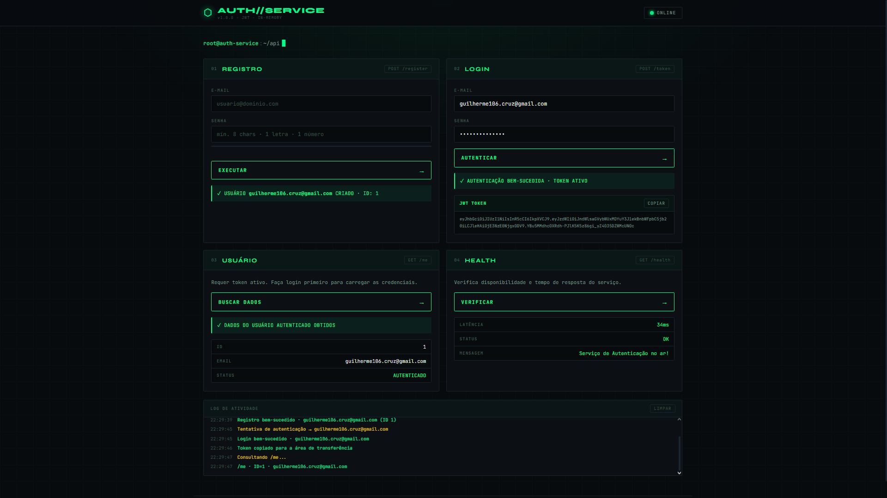
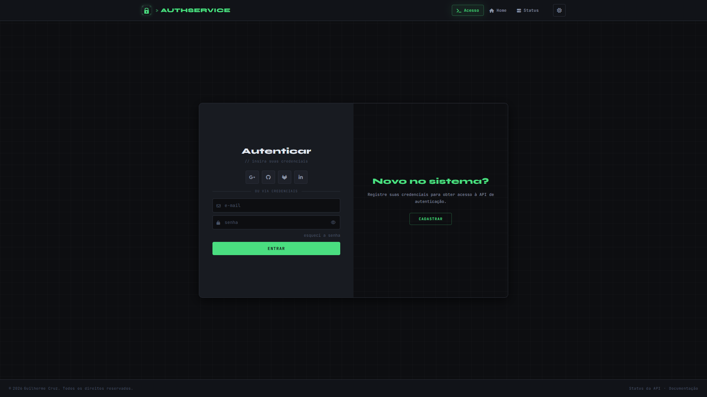
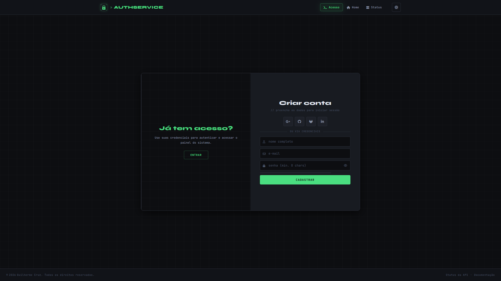
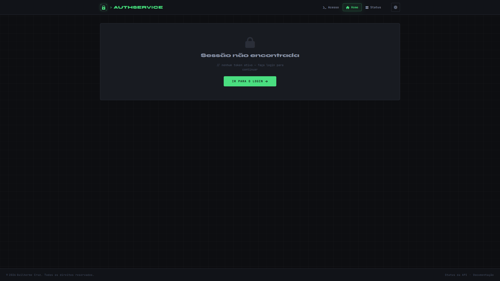
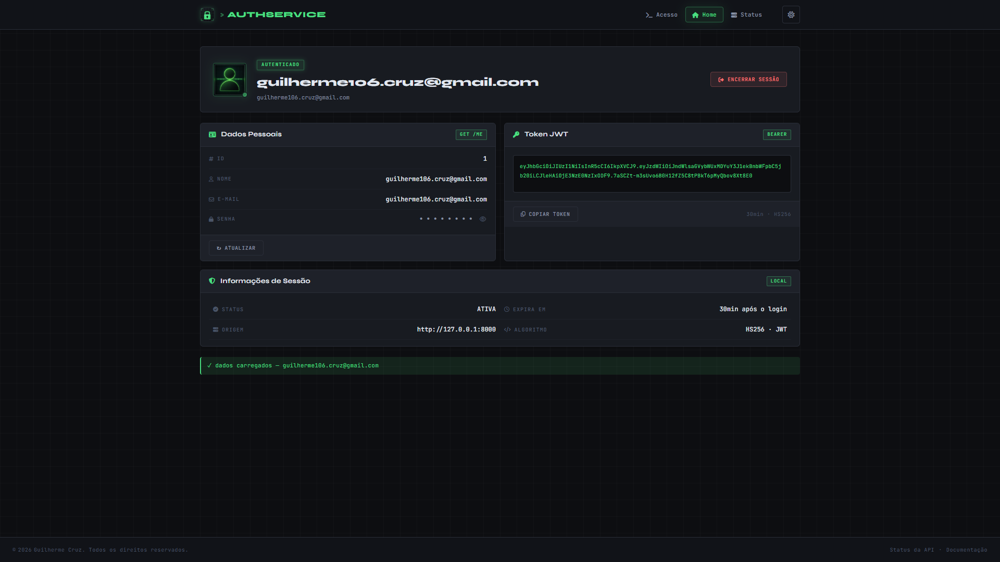
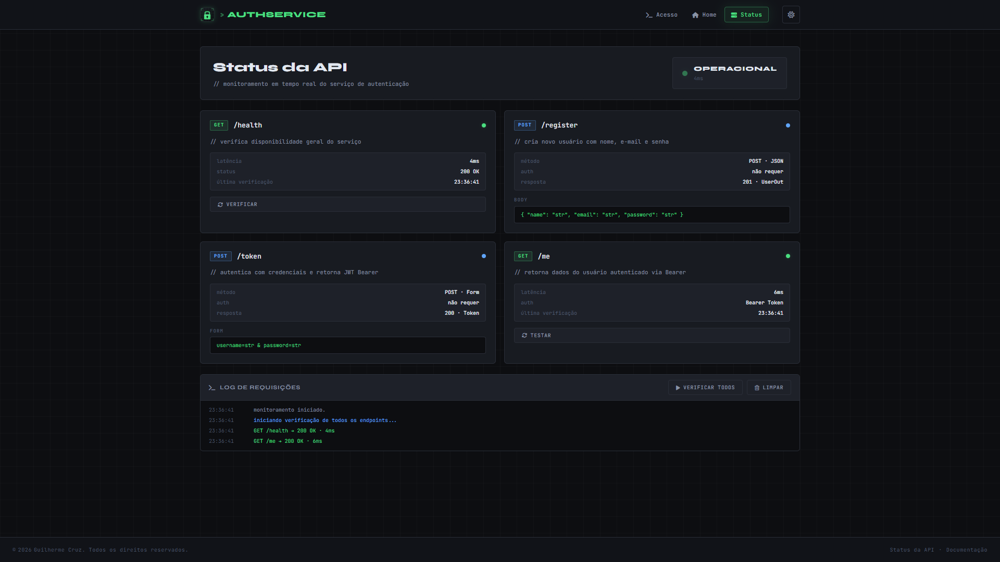

<h1 align="center">🔐 AuthService</h1>

<p align="center">
  Sistema de autenticação fullstack com tema <strong>Dark Industrial Terminal</strong> —<br/>
  API REST em FastAPI com JWT e frontend integrado, servido em um único container Docker.
</p>

<div align="center">

  [](https://authservice-mbul.onrender.com/docs)
  [](./LICENSE)
  [](./Dockerfile)
  [](https://fastapi.tiangolo.com)
  [](https://python.org)

</div>

---

<div align="center">
  
</div>

---

## 🌐 Demonstração

<div align="center">

| | |
|---|---|
| 🔗 **Aplicação** | [authservice-mbul.onrender.com](https://authservice-mbul.onrender.com) |
| 📖 **API Docs** | [authservice-mbul.onrender.com/docs](https://authservice-mbul.onrender.com/docs) |
| 📡 **Health Check** | [authservice-mbul.onrender.com/health](https://authservice-mbul.onrender.com/health) |
| ⚠️ **Aviso** | Hospedado no plano gratuito do Render — primeira requisição pode levar até **50 segundos** devido ao cold start |

</div>

---

## 📌 O que é este projeto?

O **AuthService** é um serviço de autenticação completo que combina uma API REST com um frontend integrado. O backend em **FastAPI** gerencia registro de usuários, autenticação com tokens **JWT** e proteção de rotas. O frontend — servido pelo próprio backend como arquivos estáticos — oferece uma interface de login/cadastro animada, dashboard do usuário autenticado e painel de monitoramento da API em tempo real.

Tudo em um único container Docker. Simples de subir, simples de usar.

---

## ✨ Funcionalidades

- Registro de usuários com validação de e-mail e **medidor de força de senha** (5 níveis)
- Autenticação via **JWT (HS256)** com expiração configurável
- Rota protegida `/me` para dados do usuário autenticado
- **Health check** da API em tempo real
- Frontend com **tema dark/light** persistido no navegador
- Dashboard com exibição e **cópia do token JWT** com um clique
- Painel de status com **monitoramento de endpoints**, latência em ms e **log terminal** em tempo real
- Layout **responsivo** — desktop, tablet e mobile
- **Menu mobile acessível** com aria-expanded e fechamento via Escape
- Containerização completa com **Docker e Docker Compose**

---

## 🖼️ Preview

<div align="center">
  
  <br/><sub>Tela de Login — autenticação via credenciais</sub>
</div>

<br/>

| Login preenchido | Cadastro |
|---|---|
|  |  |

<br/>

| Dashboard autenticado | Sessão não encontrada |
|---|---|
|  |  |

<br/>

<div align="center">
  
  <br/><sub>Painel de Status — monitoramento de endpoints em tempo real</sub>
</div>

---

## 🧩 Páginas do frontend

### 🔑 Login / Cadastro (`index.html`)
Formulário com **toggle animado em CSS puro** entre login e registro. No desktop, um painel lateral deslizante alterna entre os modos com transição suave. No mobile, os formulários se empilham verticalmente. O cadastro inclui **medidor de força de senha** em tempo real com 5 níveis: Fraca → Razoável → Boa → Forte → Excelente.

### 🏠 Dashboard (`home.html`)
Exibe os dados do usuário autenticado obtidos via `/me`. Mostra o **token JWT completo** com botão de cópia, informações de sessão (status, expiração, origem, algoritmo) e dados do perfil. O estado sem sessão exibe uma tela de acesso negado com redirecionamento direto ao login.

### 📡 Status da API (`status.html`)
Painel de monitoramento com cards individuais para cada endpoint (`/health`, `/register`, `/token`, `/me`). Exibe **latência em ms**, status HTTP, autenticação requerida, schema do body/form e horário da última verificação. O **log terminal** registra todas as requisições com scroll automático e cores por tipo (success, error, info).

---

## 🛠️ Tecnologias utilizadas

**Backend:**
- **FastAPI** — framework web moderno e de alta performance
- **Uvicorn** — servidor ASGI com suporte a uvloop
- **Pydantic v2** — validação de dados e schemas DTOs
- **python-jose** — geração e validação de tokens JWT
- **bcrypt 4.0.1** — hash seguro de senhas com salt
- **pydantic-settings** — configuração via arquivo `.env`

**Frontend:**
- **HTML5 / CSS3 / JavaScript** — vanilla, sem frameworks externos
- **JetBrains Mono + Syne** — tipografia mono e display via Google Fonts
- **Font Awesome** — ícones

**Infraestrutura:**
- **Docker + Docker Compose** — containerização e orquestração
- **StaticFiles (FastAPI)** — frontend servido pelo próprio backend

---

## 🗂️ Estrutura de arquivos

```
auth-service/
│
├── backend/
│   ├── api/
│   │   └── auth_routes.py        → Controllers HTTP (registro, login, /me, /health)
│   ├── core/
│   │   ├── config.py             → Configurações via pydantic-settings
│   │   ├── logger.py             → Logger configurado para stdout
│   │   └── security.py           → bcrypt + JWT (criar/decodificar tokens)
│   ├── dependencies/
│   │   └── dependencies.py       → Injeção de dependências FastAPI
│   ├── models/
│   │   └── user.py               → Modelo de domínio User
│   ├── repositories/
│   │   └── user_repository.py    → Acesso a dados in-memory
│   ├── schemas/
│   │   └── user_schemas.py       → DTOs Pydantic (UserCreate, UserOut, Token)
│   ├── services/
│   │   └── auth_service.py       → Regras de negócio (registro, autenticação)
│   └── main.py                   → Entry point FastAPI + mount do frontend
│
├── frontend/
│   ├── index.html                → Login/Cadastro com toggle animado
│   ├── home.html                 → Dashboard do usuário autenticado
│   ├── status.html               → Monitoramento de endpoints em tempo real
│   ├── css/
│   │   ├── tokens.css            → Design tokens e variáveis CSS (dark/light)
│   │   ├── components.css        → Header, nav, botões, inputs, cards
│   │   ├── auth.css              → Estilos exclusivos da página de auth
│   │   ├── home.css              → Estilos do dashboard
│   │   ├── status.css            → Estilos do painel de status
│   │   └── responsive.css        → Breakpoints (1024px, 768px, 480px, 360px)
│   └── js/
│       ├── utils.js              → Helpers compartilhados (DOM, sessão, alertas)
│       ├── theme.js              → Alternância dark/light com persistência
│       ├── nav.js                → Menu mobile com acessibilidade
│       ├── auth.js               → Lógica de login/cadastro e força de senha
│       ├── home.js               → Lógica do dashboard e cópia do JWT
│       └── status.js             → Ping de endpoints e log terminal
│
├── read-model/
│   └── img/                      → Imagens do README
│       ├── Banner.png
│       ├── Login01.png
│       ├── Login02.png
│       ├── Cadastro01.png
│       ├── Home01.png
│       ├── Home02.png
│       └── Status.png
│
├── .env                          → Variáveis de ambiente (não commitado)
├── .env.example                  → Exemplo de configuração
├── .gitignore
├── docker-compose.yml
├── Dockerfile
├── requirements.txt
├── CONTRIBUTING.md               → Guia de contribuição
└── MODEL.md                      → Documentação arquitetural aprofundada
```

---

## 🎨 Sistema de design

O frontend utiliza um **design system** com tokens CSS completos para dois temas:

| Token | Tema Escuro | Tema Claro |
|---|---|---|
| Background | `#0d0e11` | `#f0f1f3` |
| Surface | `#181b21` | `#ffffff` |
| Texto primário | `#e2e8f0` | `#111827` |
| Accent | `#4ade80` — verde neon | `#166534` — verde escuro |
| Danger | `#f87171` | `#dc2626` |
| Warning | `#fbbf24` | `#d97706` |
| Border | `#2a2e38` | `#d1d5db` |
| Grid de fundo | `rgba(255,255,255,0.025)` | `rgba(0,0,0,0.035)` |

O grid terminal de fundo é gerado via `background-image` com `linear-gradient` — sem imagens externas.

---

## 📡 Endpoints da API

Documentação interativa disponível em **`/docs`** após subir o serviço.

### Rotas públicas

| Método | Endpoint | Descrição | Auth |
|---|---|---|---|
| `GET` | `/health` | Status e latência da API | ❌ |
| `POST` | `/register` | Registrar novo usuário | ❌ |
| `POST` | `/token` | Autenticar e obter token JWT | ❌ |

### Rotas protegidas

| Método | Endpoint | Descrição | Auth |
|---|---|---|---|
| `GET` | `/me` | Dados do usuário autenticado | ✅ Bearer Token |

### Exemplos com cURL

**Registrar usuário:**
```bash
curl -X POST https://authservice-mbul.onrender.com/register \
  -H "Content-Type: application/json" \
  -d '{"email": "usuario@email.com", "password": "Senha123"}'
```

**Obter token:**
```bash
curl -X POST https://authservice-mbul.onrender.com/token \
  -d "username=usuario@email.com&password=Senha123"
```

**Acessar rota protegida:**
```bash
curl https://authservice-mbul.onrender.com/me \
  -H "Authorization: Bearer SEU_TOKEN_AQUI"
```

---

## ⚙️ Variáveis de Ambiente

Crie um arquivo `.env` na raiz do projeto:

| Variável | Descrição | Padrão | Obrigatório |
|---|---|---|---|
| `SECRET_KEY` | Chave secreta para assinar tokens JWT | — | ✅ Sim |
| `ALGORITHM` | Algoritmo de assinatura JWT | `HS256` | Não |
| `ACCESS_TOKEN_EXPIRE_MINUTES` | Expiração do token em minutos | `60` | Não |

**Exemplo `.env`:**
```env
SECRET_KEY=sua-chave-secreta-muito-longa-e-aleatoria-aqui
ALGORITHM=HS256
ACCESS_TOKEN_EXPIRE_MINUTES=60
```

Gere uma `SECRET_KEY` segura:
```bash
python -c "import secrets; print(secrets.token_hex(32))"
```

> ⚠️ Nunca commite o arquivo `.env` com valores reais. Certifique-se que ele está no `.gitignore`.

---

## 🚀 Como rodar

### Com Docker *(recomendado)*

**1. Clone o repositório:**
```bash
git clone https://github.com/https-shini/AuthService.git
cd AuthService
```

**2. Configure o ambiente:**
```bash
cp .env.example .env
# Edite o .env com sua SECRET_KEY
```

**3. Suba o container:**
```bash
docker compose up --build -d
```

**4. Acesse:**
```
Frontend:  http://localhost:8000
API Docs:  http://localhost:8000/docs
```

**Parar o serviço:**
```bash
docker compose down
```

**Ver logs em tempo real:**
```bash
docker logs auth-service-v2 -f
```

---

### Sem Docker *(execução local)*

**1. Clone e crie o ambiente virtual:**
```bash
git clone https://github.com/https-shini/AuthService.git
cd AuthService
python -m venv venv
source venv/bin/activate   # Linux/Mac
venv\Scripts\activate      # Windows
```

**2. Instale as dependências:**
```bash
pip install -r requirements.txt
```

**3. Configure e execute:**
```bash
cp .env.example .env
# Edite o .env com sua SECRET_KEY
uvicorn backend.main:app --host 0.0.0.0 --port 8000 --reload
```

---

## 🤝 Como contribuir

Consulte o arquivo [CONTRIBUTING.md](./CONTRIBUTING.md) para o passo a passo completo.

```bash
git checkout -b minha-feature
git commit -m "feat: minha nova feature"
git push origin minha-feature
# Abra um Pull Request 🚀
```

---

## 📚 Documentação adicional

| Arquivo | Descrição |
|---|---|
| [CONTRIBUTING.md](./CONTRIBUTING.md) | Guia completo de contribuição (PT-BR e EN-US) |
| [MODEL.md](./MODEL.md) | Documentação arquitetural aprofundada |

---

## 📄 Licença

Este projeto está sob a licença **MIT**. Veja o arquivo [LICENSE](./LICENSE) para mais detalhes.

---

<div align="center">

Feito com 💚 — autenticação simples, segura e com estilo terminal.

⭐ Se gostou, deixe uma estrela no repositório!

</div>


